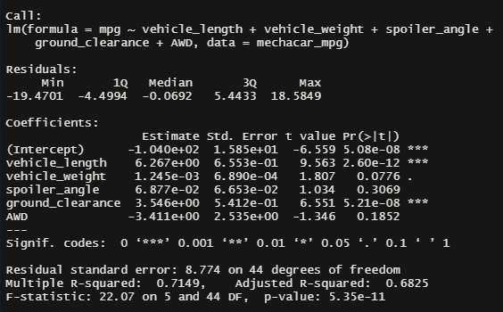
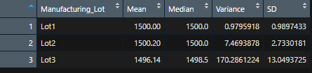
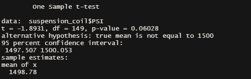
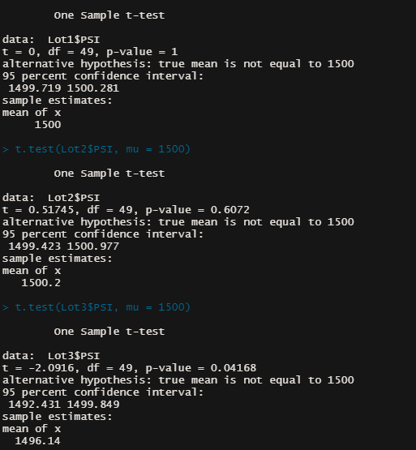

# MechaCar Statistical Analysis
## Overview
A few weeks after starting his new role, Jeremy is approached by upper management about a special project. AutosRUs’ newest prototype, the MechaCar, is suffering from production troubles that are blocking the manufacturing team’s progress. AutosRUs’ upper management has called on Jeremy and the data analytics team to review the production data for insights that may help the manufacturing team.
## Linear Regression to Predict MPG

  By examing the data provided it can be deduced that Vehicle Length and Ground Clearance provide the most non-random amount of variance when testing for MPG values. This means that these two factors will have the most impact on the MPG the prototype is recieving. The rest iof the variables showed no indication of being significant and rather show some random variance.
  With a P-Value of 5.35e-11 being lower than the signifcance level of 0.05% we can then go on to reject the null hypothesis and, in doing so, we have significant evidence that the slope of our model is not zero. 
  In conclusion, having a total R-Squared value of 0.7149 or about 71% it can be concluded that the linear model does an effective job of prediciting MPG for MechaCar prototypes. 
## Summary Statistics on Suspension Coils

To start, the data above represents the Pounds Per Square Inch or PSI of the coils tested. The data provided shows how the coils performed under different weight capacities. We were then tasked to find out if the manufacturing data met the design specifications for all the lots in total and each lot individually. 

When looking more closey at the data, we had to look to ensure that the variance of the suspension coils must not exceed 100 pounds per square inch, as these were the design specifications for the MechaCar. The variance of the PSI is 62.29 which is under the 100 PSI threshold. Looking at each lot individually we can see that Lots 1 and 2 are well within the range of the PSI having a 0.98 and a 7.47 PSI variance, respectfully. Lot 3, however, shows a variance of 170.29, well over the threshold of 100 PSI. 

## T-Tests on Suspension Coils

To begin we ran a T Test on every manufacturing lot

Summarizing this data we can see that the mean value of all of the lots is 1498.78. Additionally, the P-Value of this data set is equal to 0.06 which is higher than our baseline of 0.05 meaning that the findings here are not supportive of rejecting the null hypothesis. When we look at the lots individually, as shown below, we can find more specific information on each lot.

  - Lot 1 has a P-Value of exactly 1 and a true mean of 1500, meaning that we cannot reject the null hypothesis as there is no evidence of a statistical difference between population and sample means.
  - Lot 2 simialrly has a mean of 1500.2 but the P-Value differs greatly at 0.61 but we can still fail to reject, or accept, the null hypothesis.
  - Lot 3 differes significantly to the first two, witha  P-Value of 0.042 and a mean value of 1496.14. With a P-Value below our siginificance level of 0.05 we can conclude that we will reject the null hypothesis and that, for Lot 3, the sample and the population means are not statistically different.
  - 

## Study Design: MechaCar vs Competition

Finally, we were asked to create a statistical study that can quantify how MechaCars performs against the competition and to conclude which metrics would be most important to the consumer. 
  ### Metrics to be tested would include:
  - Safety Ratings
  - Highway Fuel Efficiency
  - Current Selling Price
  - Resale Value
  - Maitenence Cost

### Hypothesis
- Null Hypothesis: The Current Selling Price and Resale Value will be directly coorelated with key metrics related to car ownership
- Alternative Hypothesis: The Current Selling Price and Resale Value will not be based on key metrics related to car ownership

### Multiple Linear Regression
To accomplish this statistical study we will need to run a multiple linear regression on both Current Value and Resale Value of MechaCars are coorelated with the metrics listed above. A mutliple Linear regression will give us the opportinity to examine multiple causal factors at once, wherein then we can refine our examination to look at key specific metrics afterwards.
